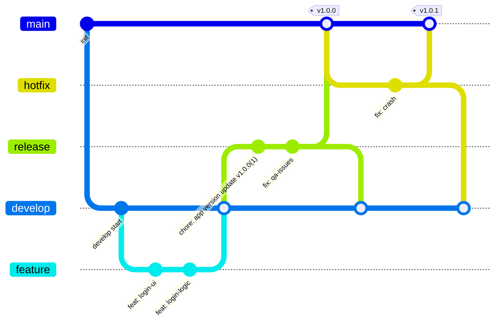

# FinQ-iOS

### Git Convention
#### Commit Type

| 타입 | 설명 |
| --- | --- |
| `feat` | 새로운 기능 추가 또는 기존 기능의 동작 변경 |
| `fix` | 의도와 다르게 동작하는 버그 수정 |
| `refactor` | 기능 변경 없는 코드 구조 개선 |
| `style` | 코드 포맷 변경 |
| `docs` | 문서 작업 |
| `test` | 테스트 코드 추가 또는 수정 |
| `chore` | 빌드, 설정, 패키지 등 기타 작업 |

#### Git Strategy

